# Lcz_WanAndroid_kotlin
玩安卓kotlin项目
## 参考别人的项目敲
- 练习kotlin使用
- 协程基本使用
- room使用
- 黑夜模式标准适配
- 更多的注释
## 效果预览
<table>
<tr>
<td bgcolor=#dfe2e5></td>
<td bgcolor=#dfe2e5></td>
<td bgcolor=#dfe2e5>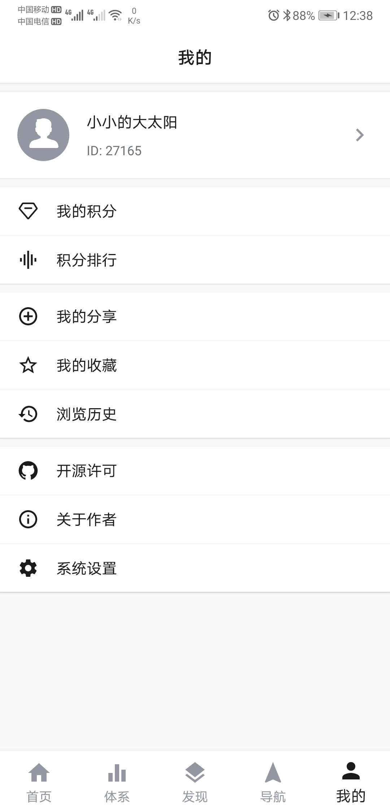</td>
</tr>
<tr>
<td bgcolor=#dfe2e5>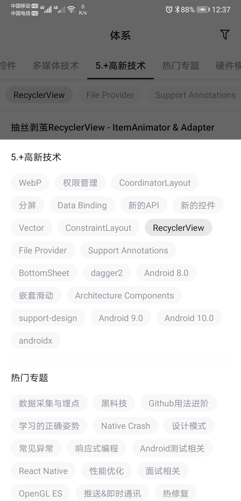</td>
<td bgcolor=#dfe2e5>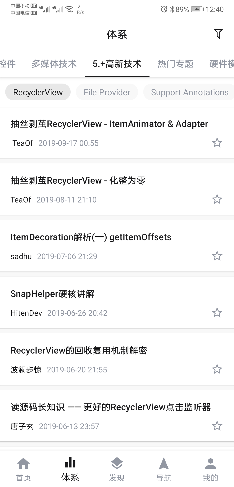</td>
<td bgcolor=#dfe2e5>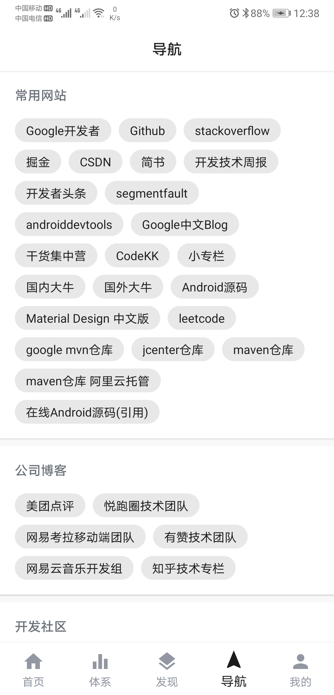</td>
</tr>
<tr>
<td bgcolor=#dfe2e5>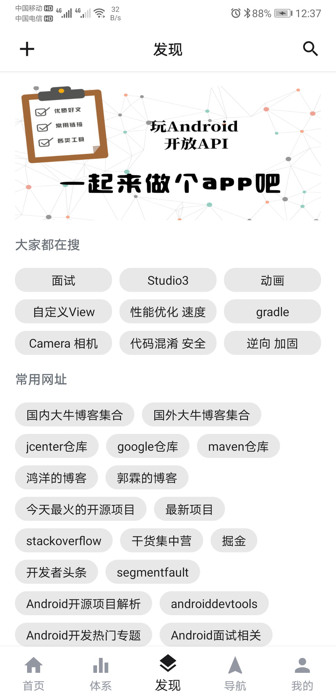</td>
<td bgcolor=#dfe2e5>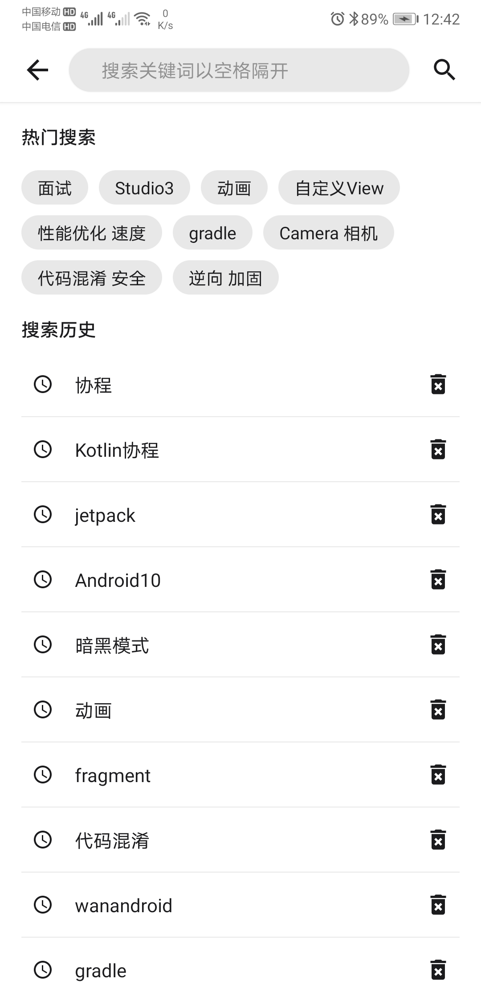</td>
<td bgcolor=#dfe2e5>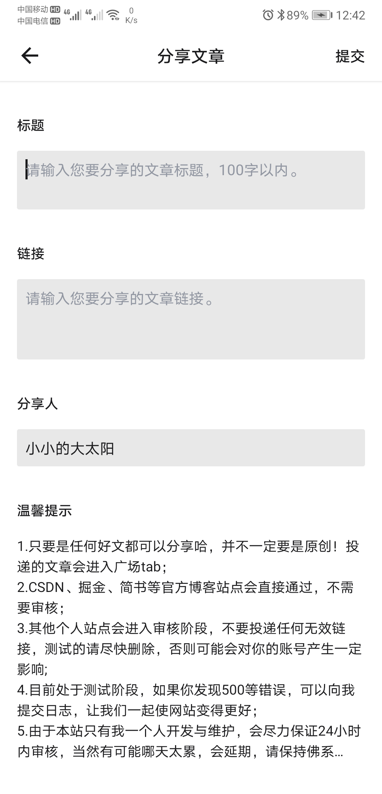</td>
</tr>
<tr>
<td bgcolor=#dfe2e5>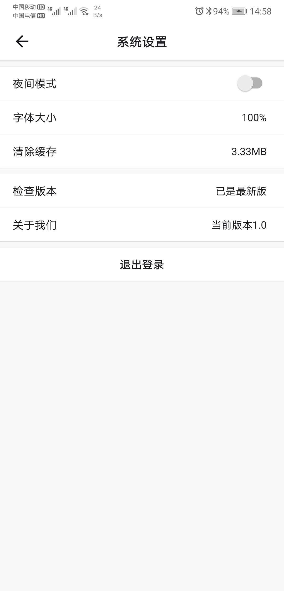</td>
<td bgcolor=#dfe2e5>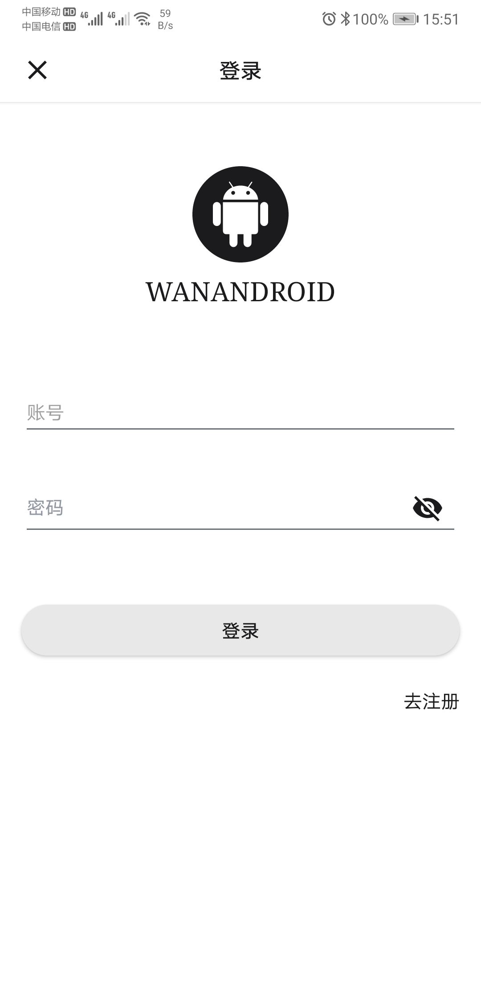</td>
<td bgcolor=#dfe2e5>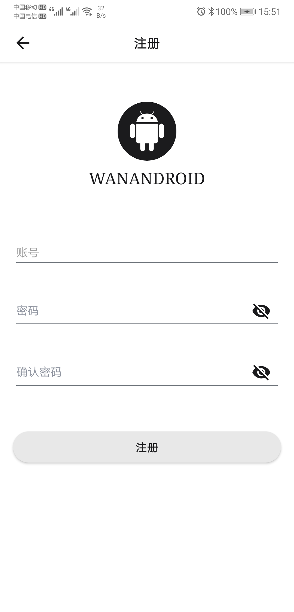</td>
</tr>
<tr>
<td bgcolor=#dfe2e5>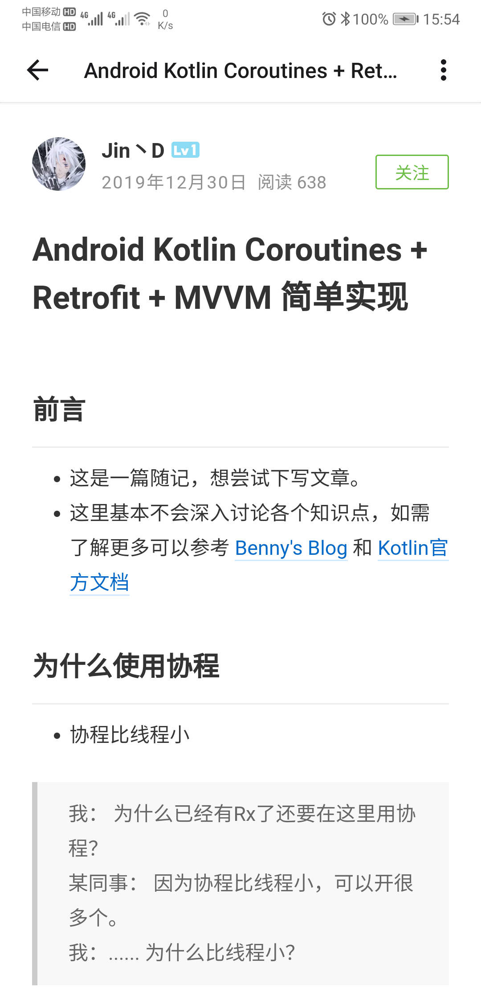</td>
<td bgcolor=#dfe2e5>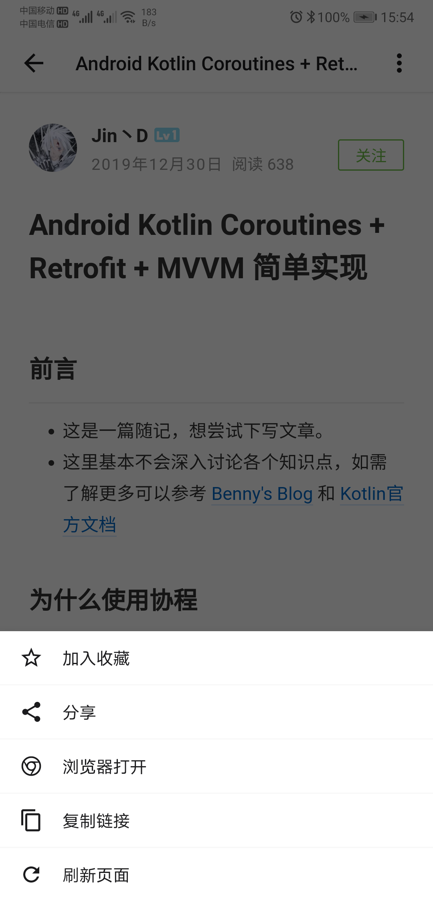</td>
<td bgcolor=#dfe2e5>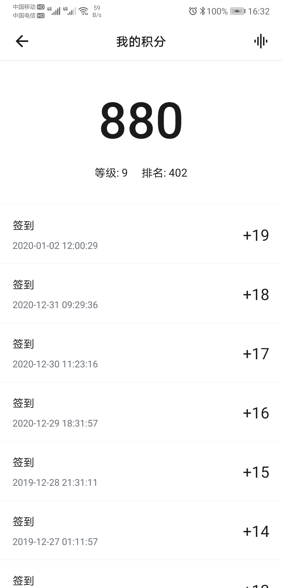</td>
</tr>
<tr>
<td bgcolor=#dfe2e5>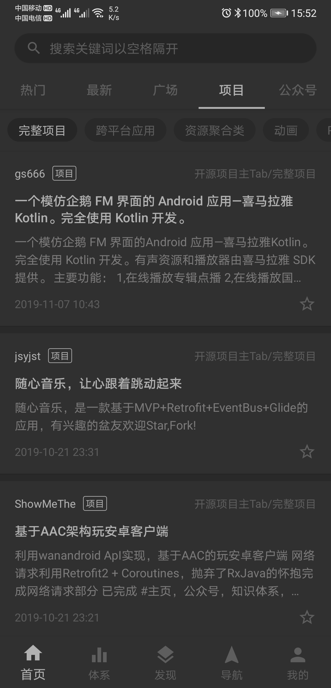</td>
<td bgcolor=#dfe2e5>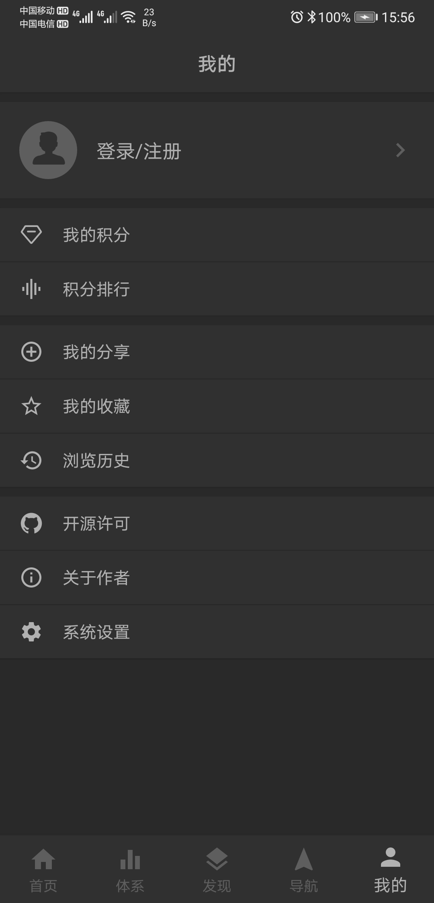</td>
<td bgcolor=#dfe2e5>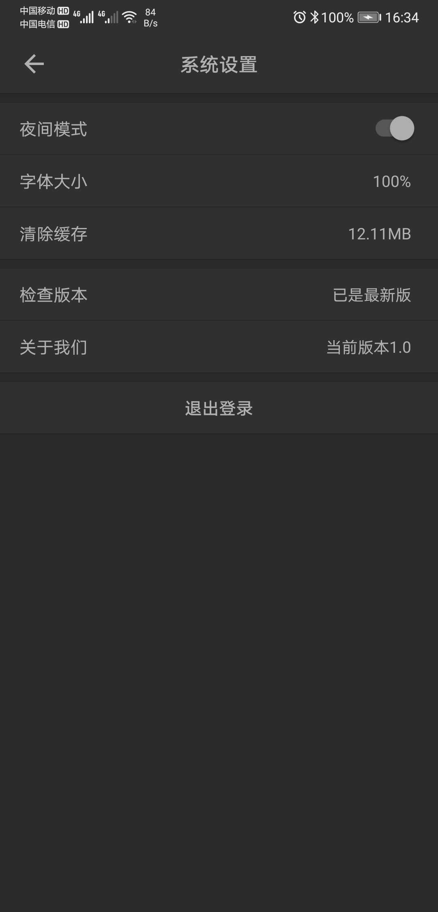</td>
</tr>
</table>